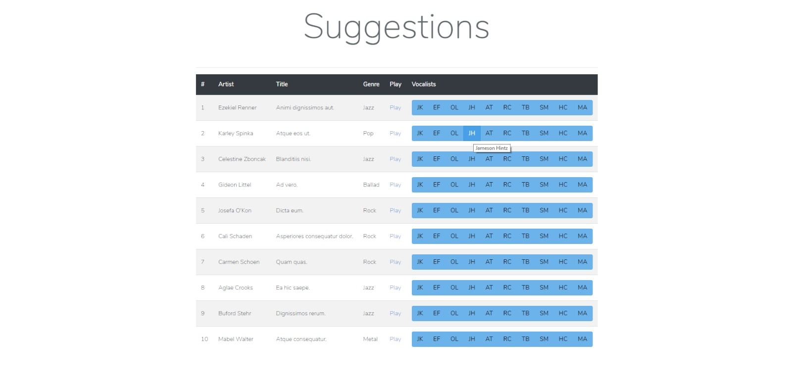

# Suggestion System

This small web-tool was originally made to be used by the Bèta Music Night committee of study asociation A–Eskwadraat. It provides their singing coaches with a way to choose songs based on the singer's talent instead of the other way around. A singer's quality is very fragile, and therefore should be aided in the best possible way. The tool was first crafted inside of Google's Sheets API but proved to be much too slow. The script would make a seperate sheet for each of our singers in which you would find the songs the singing coach deemed fit for this particular singer. Below you'll find some screenshots, of which the first two demonstrate the tool itself, and the last one the Google Sheet it was modelled after.

The database, and therefor the table, is populated automatically with randomly generated data. In these early stages the functionality of this tool is limited to changing the levels, indicated by the button colors, of the specified users for each individual song.

* Blue:     Hasn't been assigned yet
* Green:    User is able to sing this song
* Yellow:   User may be able to sing this song
* Red:      User shouldn't sing this song

